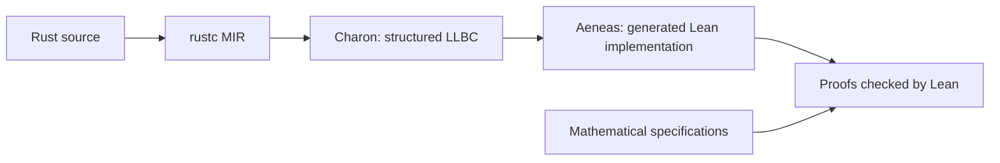

# RustHammer design and verification overview

This overview describes the state of RustHammer on 2026-10-07, including typed
permutation and the organization of grammar-building operations under `grammar`.

RustHammer currently has three connected parts: **a typed Rust parser-combinator
library, a translation of that implementation into Lean, and mathematical
specifications with proofs about the translated code**. The current
implementation uses direct execution of nonrecursive grammars. The work on
recursive grammars and packrat remains separate, deferred research.

## Grammar representation and execution

The central Rust abstraction is a **grammar value whose type determines its
output**. A primitive is usually a small struct containing configuration; a
combinator is a struct containing its children and possibly callbacks.

For example:

```rust
use rusthammer::grammar::{seq, BeU16, Byte, Seq};
use rusthammer::{Cursor, Parser};

let header: Seq<Byte, BeU16> = seq(Byte, BeU16);

let result = header.parse(&[7, 0, 3, 99], Cursor::start());
// Ok((Cursor { byte: 3, bit: 0 }, (7u8, 3u16)))
```

`seq` constructs a `Seq` containing two children. During execution, the first
child runs, then the second runs at the returned cursor, and their values become
a pair. Construction itself performs no parsing.

This retains a function-like interpretation of a parser while also preserving
grammar structure. The representation is a nested collection of concrete Rust
types, using static dispatch. There is no central, heap-allocated grammar-node
enum or universal dynamically typed AST.

The three traits separate different responsibilities:

| Trait | Responsibility |
|---|---|
| `Grammar<'input>` | Declares the associated `Output` type. |
| `Eval<'input, Backend>` | Executes the grammar using a particular backend and its mutable state. |
| `Parser<'input>` | Supplies convenient `.parse()` and `.parse_with()` methods for grammars supporting `Eval<Direct>`. |

These definitions are together in [parser_traits.rs](src/parser_traits.rs).

An associated output type means that a particular grammar type, for a particular
input lifetime, determines its output. Many different grammar types can produce
`u8`; that creates no ambiguity.

`Direct` is an empty backend. Combinators call their children's `eval` methods
and pass the same backend through every call. This boundary also supports custom
bookkeeping backends, but a backend parameter alone does not implement caching
or another parsing algorithm. Future engines still need their own implementation
and proofs.

## Input, outcomes, and parser behavior

**Input, position, execution settings, and mutable execution state are separate.**
Each evaluation receives:

- An immutable input byte slice.
- A `Cursor { byte, bit }`.
- A `ParseContext` containing bit order, byte order, and input finality.
- A mutable backend.

Its result is:

```rust
enum ParseOutcome<T> {
    Success(Cursor, T),
    Error(ParseError),
    NeedMore,
}
```

This makes consumption explicit: successful parsing returns a new cursor.
Recoverable failure allows a combinator such as `Choice` to try another child at
the original cursor. Backend bookkeeping and callback effects survive that retry.

`NeedMore` means that the supplied buffer does not establish an answer yet. It
propagates before alternatives are tried or optional absence is inferred. There
is currently no saved continuation or buffering layer: callers retry with
accumulated input and the original cursor.

Finality and full consumption are separate concepts. `.parse()` treats the
supplied input as final, but it may leave input unconsumed—as in the example
above. Compose with `End` when the grammar must consume everything.

The core is bit-oriented. Bit direction and byte significance are independently
configurable. `WithOrder` scopes those settings, with byte-aligned boundaries
required when changing bit direction. Span metadata is opt-in: `WithSpan<P>`
returns the child's value together with its span, while `Recognize<P>` returns
the span.

Outputs are ordinary Rust values. They can borrow input or grammar configuration,
and generally need neither `Copy` nor `Clone`. Parser values can themselves be
copied or cloned when their stored fields support it. The crate is `no_std`,
forbids unsafe Rust, and has no runtime dependencies. Collecting repetition uses
the optional `alloc` feature; folding repetition can accumulate results without
library allocation.

The implementation also shares machinery between related operations. `Repeat`,
`FoldRepeat`, `SepBy`, and `FoldSepBy` use a common iteration driver with different
child-selection and storage policies. Output-selection combinators reuse
sequencing. Permutation has one search implementation shared by its supported
tuple arities.

## Code organization

Paths in this table are relative to the `rusthammer/` directory unless indicated
otherwise.

| Location | What it contains |
|---|---|
| [src/lib.rs](src/lib.rs) | Crate documentation, module declarations, public re-exports, and private extraction fixtures. |
| [src/parser_traits.rs](src/parser_traits.rs) | `Grammar`, `Eval`, `Parser`, `Direct`, and shared-reference implementations. |
| [src/input_types.rs](src/input_types.rs) | Cursor, errors, outcomes, ordering configuration, and input finality. |
| [src/span_types.rs](src/span_types.rs) | The validated `BitSpan` result type and its borrowed byte view. |
| [src/grammar/](src/grammar/) | The public grammar-building namespace, with private files for numeric and byte primitives, sequencing, control flow, transformations, repetition, positions, ordering scopes, spans, and permutation. |
| [src/grammar/permutation.rs](src/grammar/permutation.rs) | Required/optional entries, tuple storage adapters, and permutation search. |
| [examples/](examples/) and [examples/support/](examples/support/) | Runnable demonstrations and reusable application grammars. The [record format](examples/support/record.rs) is shared by examples, tests, and extraction. |
| [tests/](tests/) | Native behavioral, boundary, ownership, borrowing, and cleanup tests, organized by feature. Some C comparison adapters live under `tests/compat/`. |
| [lean/RustHammer/](lean/RustHammer/) | The generated Lean implementation, specifications, supporting mathematics, and proofs. |
| [probes/](probes/) | Extraction experiments and compatibility fixtures. Some intentionally reproduce failures. The ordinary Cargo consumer here is part of routine verification. |
| [tools/verify.py](tools/verify.py) and other tools | The main verification pipeline, focused compatibility checks, C comparisons, and tuple-proof generation. |
| [../plans/](../plans/) (`rusthammer*.md`) | Design decisions, implementation status, intended capabilities, and deferred investigations. |

Application-specific types such as `Record` are kept outside the public library.
A private extraction configuration includes their shared source so the proofs
concern the same implementation that examples and native tests use.

The family files keep each grammar node's type, constructor, evaluator, and
supporting helpers together. Their public items are re-exported through
`rusthammer::grammar`, so callers need not name the private family modules.
Crate-root exports such as `rusthammer::Seq` remain available too.
The private support-module names avoid collisions with local variable names in
the Lean generated by the pinned Aeneas version.

## From Rust to Lean

**The Lean verification starts from the Rust implementation.** The pipeline is:



Charon extracts a structured representation of Rust's compiler intermediate code.
Aeneas translates it into Lean definitions. The checked-in result is
[Rusthammer.lean](lean/RustHammer/Rusthammer.lean), under the namespace
`RustHammer.Code`. We regenerate this file from Rust rather than editing it.

The translation exposes details that Rust normally hides. Trait implementations
become explicit dictionaries of operations. Mutable backend state becomes an
explicit returned value. Rust machine integers retain bounded arithmetic and
its safety obligations.

The generated functions use an outer Aeneas execution result. This is distinct
from the parser's own `ParseOutcome`: returning `ParseOutcome.Error(Mismatch)` is
an ordinary, successful execution of a rejecting parser. An outer execution
failure represents something such as a modeled panic.

That distinction explains the usual theorem notation:

```lean
parse_record input cursor parser
  ⦃ result => Spec.recordOutcome input cursor result ⦄
```

Under the theorem's hypotheses, this means:

> The translated computation terminates normally and returns a result satisfying
> the stated contract.

It therefore covers termination and absence of modeled execution failures, as
well as the returned value. Expected parse errors can—and often should—satisfy
that contract.

## Specifications and proof organization

**Specifications describe what parsing means using mathematics.** They commonly
use unbounded natural numbers or integers, lists, and relations between inputs
and outcomes.

For instance, the numeric-field specification defines the decoded value by
positional binary notation. It specifies that a successful width-`w` read
advances exactly `w` bits. The proof connects the Rust shifts, masks, fragments,
and machine arithmetic to that mathematical definition.

Within the Lean directory, the organization largely follows this pattern:

- `*Spec.lean` defines meaning and contracts.
- `*Proofs.lean` proves the translated implementation satisfies them.
- Supporting modules such as `OrderMath.lean` and `RepeatSupport.lean` handle
  reusable arithmetic or driver obligations.
- [RustHammer.lean](lean/RustHammer.lean) is the top-level import list for the
  proof project.

There is also a small adaptation layer: `DirectState.lean`, `Direct.lean`, and
`DirectEquations.lean`. These specialize extracted evaluators to `Direct`,
project away its empty state, and expose convenient equations. Their connection
to the generated implementation is proved. They are not an independently assumed
parser implementation.

Most existing contracts concern direct execution.
[BackendProofs.lean](lean/RustHammer/BackendProofs.lean) additionally proves
sequencing and choice with arbitrary backend state transitions. Span and
permutation proofs also explicitly account for backend state.

**The proofs are compositional.** A sequencing theorem assumes contracts for its
two children and establishes the sequencing contract: the second child starts at
the first child's successful cursor, outputs are paired, and errors or
incompleteness propagate correctly. An application can instantiate that theorem
instead of reproving sequencing's implementation.

Callbacks and custom parsers require their own contracts. For example, a `Map`
proof needs to know that its callback terminates and has the desired relationship
between input and output. Such obligations can be restricted to values actually
reachable after child success. Merely constructing a grammar from library
combinators does not automatically prove an application's intended format
specification.

Configuration invariants are explicit too. Rust makes a `Bits` width private and
validates it in its constructor. The extracted Lean structure can nevertheless
be written down with any width, so parsing theorems assume `validBits`;
constructor theorems establish that invariant. This connects validated
construction to safe execution.

## Properties proved

The main proved properties are:

| Area | Properties established |
|---|---|
| Constructors and primitives | Valid configuration, exact decoded values, exact consumption, safe indexing/arithmetic/casts, and specified rejection of invalid cursors or insufficient input. |
| Composition and control flow | Sequencing, ordered-choice priority, optionality, lookahead, output selection, mapping, and error/`NeedMore` propagation, under child contracts. |
| Repetition and separated lists | Output counts and order, cursor chaining, stopping and rollback rules, fold results, progress checks, count-overflow handling, and termination. |
| Dependent parsing | Correct use of a successful first value to construct the next parser, correct cursor transfer, and short-circuiting before unused factories or children. |
| Ordering and spans | Correct physical-bit interpretation, scope-boundary rules, span validity, exact selected-bit geometry, and aligned byte views. |
| Permutation | Agreement with the ordered-search model, termination under child contracts, safe counters, backend transitions, and tuple storage/output-order equations. |
| Application grammars | Acceptance and rejection according to independently stated format contracts, including decoded contents and consumption. |

Termination arguments vary with the operation. Finite repetition decreases its
remaining permitted calls, allowing empty successes. Unbounded repetition checks
strict progress and decreases the remaining input bits. Permutation decreases
the remaining entries and candidates. These are mathematical termination
arguments; physical stack exhaustion remains outside them.

The bounded record example gives a concrete picture of an application proof.
Its format is:

```text
version: 3 bits | flags: 5 bits | length: 16 bits | payload: length bytes | EOF
```

The [record specification](lean/RustHammer/RecordSpec.lean) independently
describes decoding and rejection conditions. The
[record proofs](lean/RustHammer/RecordProofs.lean) establish that:

- Valid aligned records with version 1 and payload length at most 1,024 bytes are
  accepted.
- Successful results contain the specified version, flags, and exact input
  subsequence.
- Payload length matches the declared length, and the final cursor is canonical
  EOF.
- Invalid inputs receive the specified errors, including their precedence.
- Separate partial-input proofs cover incomplete data and waiting for EOF
  confirmation.

This provides both valid-input acceptance and correctness of returned results,
together with the rejection contract.

## Verification workflow and limits

**The verification pipeline checks several different kinds of evidence.** From
`rusthammer/`, `tools/verify.py` checks pinned tools, runs native tests with and
without allocation, regenerates the primary Lean implementation, and builds the
proofs. It also checks extraction from optimized MIR and from a separate Cargo
consumer.

Those extra extraction checks matter because downstream dependency bodies arrive
through a different compiler stage. They establish translation and Lean
type-checking compatibility; the existing semantic proofs use the primary
promoted-MIR translation. We have not separately proved equivalence between
compiler stages.

At the snapshot described here, the pipeline checks 57 consumer entry points and
audits the axiom dependencies of 156 selected theorem roots. That is an audit
count, not the total number of theorems. Project files contain no admitted
obligations or project-defined axioms. Native tests and C comparisons provide
additional evidence, including pointer identity and destructor behavior.

The limits are explicit:

- The proofs rely on the pinned translation tools, their execution/library
  models, and Lean's checker; they do not verify the compiler or translation
  pipeline itself.
- Slice proofs describe contents rather than physical pointer identity.
  Arbitrary user destructors are outside these functional contracts.
- Allocation failure, physical memory limits, and stack overflow are not
  covered. This includes the current permutation stack concern.
- C comparisons cover selected operations and corpora; there is no general
  proof of equivalence with C Hammer.
- Recursive grammars, production packrat, and buffering/resumption are not
  implemented. Native floating-point fields/ranges are excluded from the first
  release due to the [pinned Aeneas limitations](probes/floating_point/README.md).
  Seeking and diagnostics remain candidates for the first version.

## Suggested reading path

For a first reading, follow one small operation through the layers: the traits
in [parser_traits.rs](src/parser_traits.rs), `Seq` in
[grammar/sequence.rs](src/grammar/sequence.rs), its outcome relation in
[PartialSpec.lean](lean/RustHammer/PartialSpec.lean), and `seq_with_spec` in
[PartialProofs.lean](lean/RustHammer/PartialProofs.lean). Then read the record
specification and its application theorem. That shows how the implementation,
reusable combinator contracts, and format-level guarantees fit together.
